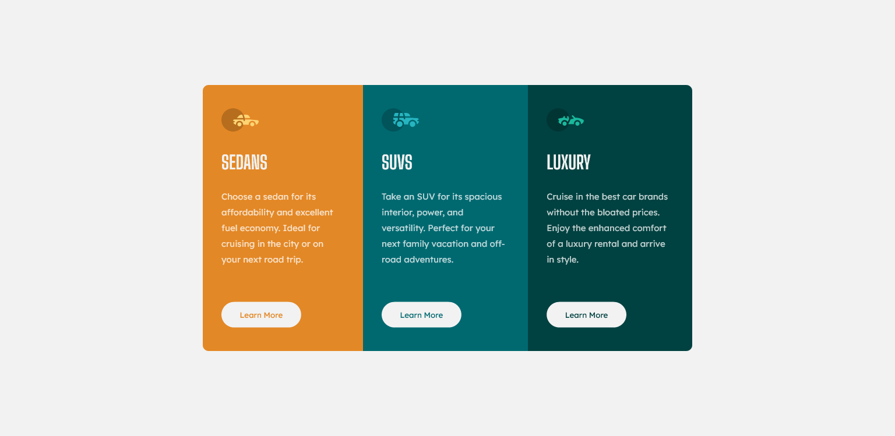
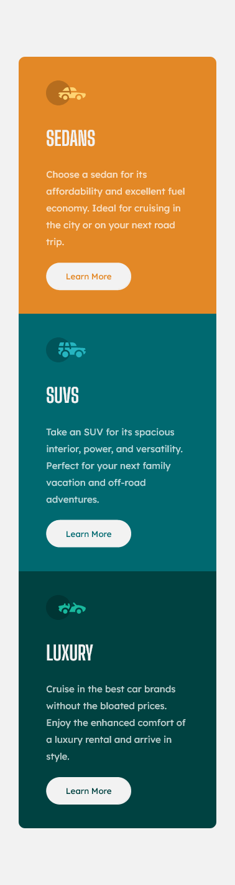

# a 3-column preview card 

a 3-column card layout design challenge 

- A) Recreate a 3-column card design using CSS Flexbox  Layout
  - This task should be on the `index.html` file .

- B) Recreate the design using CSS Grid Layout  
  - This task should be on the `grid.html` file.

### Screenshot

### The challenge

Users should be able to:

- View the optimal layout depending on their device's screen size
- See hover states for interactive elements

### Links

- Live Site: []

### Built with

- HTML5 markup
- CSS 
- Flexbox

### Resources

- [Link to the recorded video for CSS Flexbox](https://www.youtube.com/watch?v=WUBnyr-9tug&feature=youtu.be)

- [Link to the recorded video for CSS Grid](https://www.youtube.com/watch?v=0xMQfnTU6oo)

- [Link to GitHub videos](https://youtube.com/playlist?list=PLxuUHF3OiqfVlhMh2XaA7gx_NaavKM7C9)

- [https://www.w3schools.com/html/html_layout.asp](https://www.w3schools.com/html/html_layout.asp)

